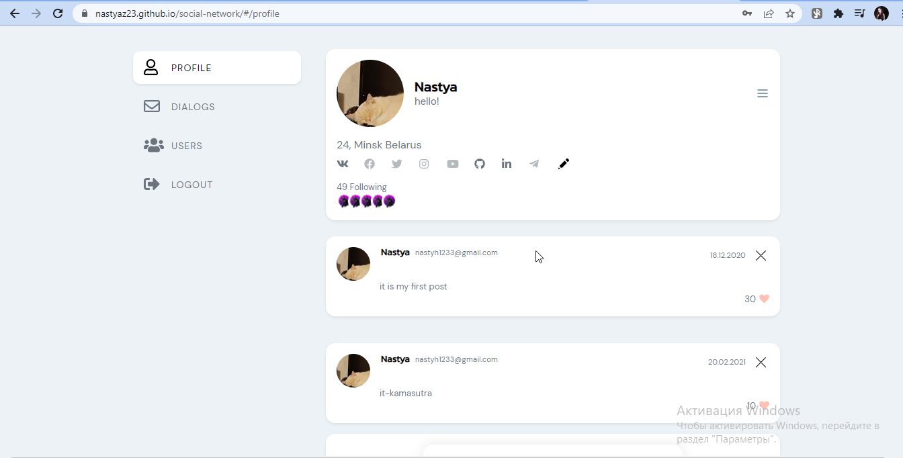
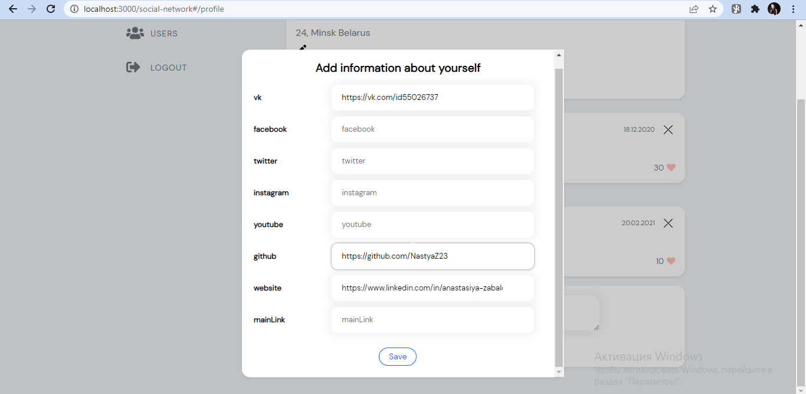
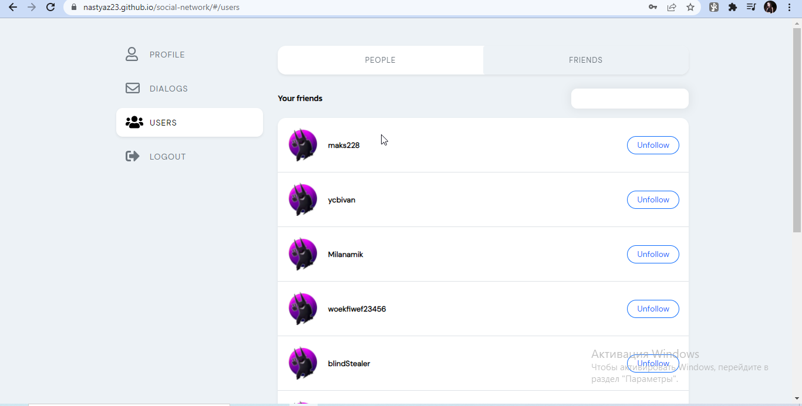
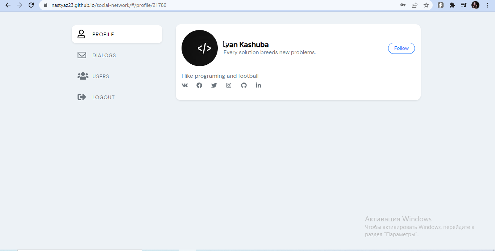

### Application is still under development
<br/>

# Social Network

<a href="https://anastasiyadev97.github.io/social-network/">
  <div>
   <h3><a href="https://anastasiyadev97.github.io/social-network/">Link to app </a></h3>
  </div>
</a>

Social Network
<br/>


### Stack: React (class, functional, hooks, hoc), Redux (thunk), Axios, Formik, TypeScript, SCSS, HTML5, React-router-dom

<br/>


My implementation of a social network. Ability to edit your profile, add friends. The authorization process has been implemented.
<br/>
Functionality: modals, pagination, searching, working with files (photo upload)


<br/>
<br/>

On the profile page you can change your profile photo, status and username, add posts and social media links.

<br/>
<br/>


<br/>
<br/>


<br/>
<br/>

On the users tab, you can view users and friends, subscribe and unsubscribe from users. Implemented search and pagination. The ability to view the user profile has been implemented.

<br/>
<br/>


<br/>
<br/>


<br/>


## Launch of the project ⏯

<br/>

To start the project, you need to enter the folder - 📂 my-app and type the command in the terminal:

```javascript
yarn
```

<br/>


Type command in terminal:

```javascript
yarn start
```

<br/>
